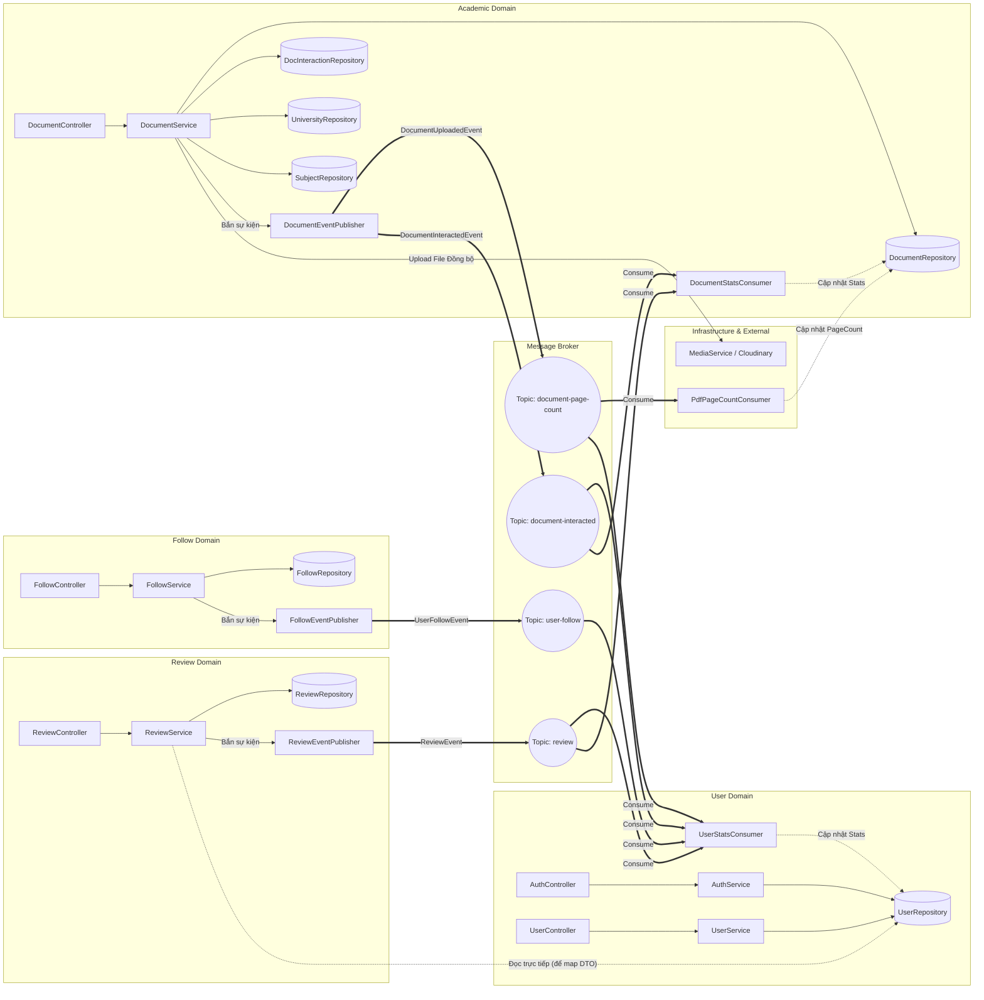

# Sơ đồ Nghiệp vụ Chi tiết Toàn hệ thống (Comprehensive Business Flow)

Sơ đồ này mô tả CHI TIẾT sự tương tác giữa các Domain trong hệ thống. Nó bao gồm các luồng gọi trực tiếp (Synchronous), các luồng đọc chéo Domain (nếu có), và luồng giao tiếp bất đồng bộ qua Message Broker (Kafka/Events). Sơ đồ này phục vụ cho việc phân tích kiến trúc và ranh giới (boundaries) của các Domain.

