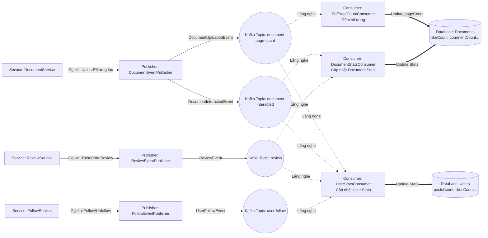

# Sơ đồ Kiến trúc Hướng Sự kiện (Event-Driven Flow)

Sơ đồ này mô tả luồng bất đồng bộ (asynchronous) xử lý các side-effects như: cập nhật thống kê (posts, likes, comments, follows), đếm số trang PDF, và có thể mở rộng cho Notifications sau này.

